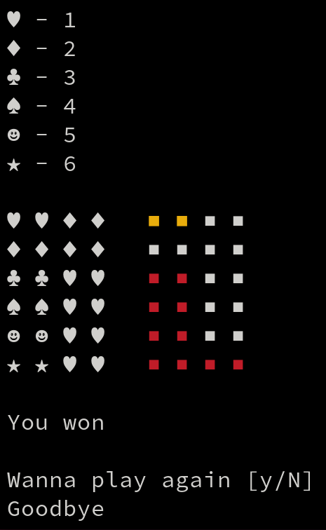
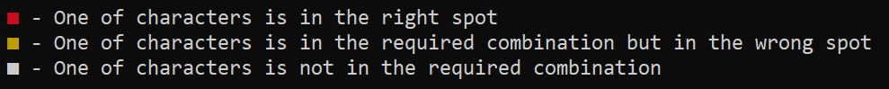

# Skocko Game



## Description

This repository contains a C implementation of the Skocko game. Skocko is a code-breaking game where one player creates a secret pattern of symbols, and the other player tries to guess the pattern within a limited number of attempts.

## How to Play

1. Clone the repository:

```shell
git clone https://github.com/m1ad3n/skocko.git
```

2. Compile the source code:

```shell
make
```


3. Run the game:

```shell
./target/build/skocko
```

4. Follow the prompts and make guesses based on the feedback provided.



## Gameplay Instructions

- The code-maker selects a secret pattern of symbols from a set of six possibilities.
- The code-breaker attempts to guess the pattern within the given number of attempts.
- After each guess, the code-maker provides feedback to the code-breaker indicating correct symbols in the correct position (marked as red) and correct symbols in the wrong position (marked as yellow).
- Use the feedback to deduce the correct pattern and make subsequent guesses.
- The game ends when the code-breaker successfully guesses the pattern or runs out of attempts.

## License

This project is licensed under the [MIT License](LICENSE).
